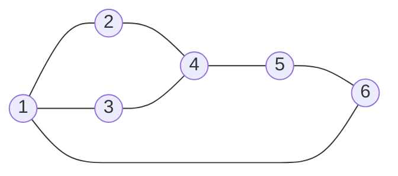

@[bilibili](BV1dh4y1o7x9)

## Graph Example

```mermaid
graph LR
    1((1)) --- 2((2))
    1((1)) --- 3((3))
    2((2)) --- 4((4))
    3((3)) --- 4((4))
    4((4)) --- 5((5))
    5((5)) --- 6((6))
    6((6)) --- 1((1))
```