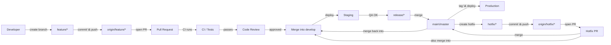

官方文档：<https://git-scm.com/>

Git 是一个免费的开源分布式版本控制系统, 旨在处理从小型到非常大的项目，提升速度和效率。

Git 是「分布式」的，fork 「仓库」后，每位开发者都可以拥有一份代码的「副本」，并在各自的「分支」上进行开发，通过 Pull Request 进行 Merge 操作。



每个开发者提交的 Commit 都是独一无二的，每个文件和提交都会被校验和，并在检出时通过其校验和进行检索。

「暂存区」是介于本地「工作区」与远程「仓库」的地带，使用 `git add <filename.suffix>` 添加文件到「暂存区」，再 `git commit` 到本地仓库并 `push` 到远程仓库。当然，你可以直接 `git commit -a` 添加所有。

Git 使用 GNUv2.0 进行开发，这是 Linus 和 Git 的核心理念，即你用了这种开源许可证的软件中的代码，那你也得开源，著名项目事件 `OpenWRT`。

## Git 命令

手册：<https://git-scm.com/docs/git#_git_commands>

```text
git [-v | --version] [-h | --help] [-C <path>] [-c <name>=<value>]
    [--exec-path[=<path>]] [--html-path] [--man-path] [--info-path]
    [-p | --paginate | -P | --no-pager] [--no-replace-objects] [--no-lazy-fetch]
    [--no-optional-locks] [--no-advice] [--bare] [--git-dir=<path>]
    [--work-tree=<path>] [--namespace=<name>] [--config-env=<name>=<envvar>]
    <command> [<args>]
```

## giteveryday

常用 git 命令

### Individual

自己写项目使用这些

> init,log,switch,branch,add,diff,status,commit,restore,merge,rebase,tag

e.g.1. 使用 tarball 作为新存储库的起点。

```shell
$ tar zxf frotz.tar.gz
$ cd frotz
$ git init
$ git add . (1)
$ git commit -m "import of frotz source tree."
$ git tag v2.43 (2)
```

e.g.2. 创建主题分支并开发。

```shell
$ git switch -c alsa-audio (1)
$ edit/compile/test
$ git restore curses/ux_audio_oss.c (2)
$ git add curses/ux_audio_alsa.c (3)
$ edit/compile/test
$ git diff HEAD (4)
$ git commit -a -s (5)
$ edit/compile/test
$ git diff HEAD^ (6)
$ git commit -a --amend (7)
$ git switch master (8)
$ git merge alsa-audio (9)
$ git log --since='3 days ago' (10)
$ git log v2.43.. curses/ (11)
```

### Individual Developer (Participant)

> clone,pull,fetch,push,format-patch,send-email,request-pull

e.g.1.克隆上游并处理它。将更改馈送到上游。

```shell
$ git clone git://git.kernel.org/pub/scm/.../torvalds/linux-2.6 my2.6
$ cd my2.6
$ git switch -c mine master (1)
$ edit/compile/test; git commit -a -s (2)
$ git format-patch master (3)
$ git send-email --to="person <email@example.com>" 00*.patch (4)
$ git switch master (5)
$ git pull (6)
$ git log -p ORIG_HEAD.. arch/i386 include/asm-i386 (7)
$ git ls-remote --heads http://git.kernel.org/.../jgarzik/libata-dev.git (8)
$ git pull git://git.kernel.org/pub/.../jgarzik/libata-dev.git ALL (9)
$ git reset --hard ORIG_HEAD (10)
$ git gc (11)
```

e.g.2.推送到另一个存储库。

```shell
satellite$ git clone mothership:frotz frotz (1)
satellite$ cd frotz
satellite$ git config --get-regexp '^(remote|branch)\.' (2)
remote.origin.url mothership:frotz
remote.origin.fetch refs/heads/*:refs/remotes/origin/*
branch.master.remote origin
branch.master.merge refs/heads/master
satellite$ git config remote.origin.push \
	   +refs/heads/*:refs/remotes/satellite/* (3)
satellite$ edit/compile/test/commit
satellite$ git push origin (4)

mothership$ cd frotz
mothership$ git switch master
mothership$ git merge satellite/master (5)
```

e.g.3.从特定标记分支出来。

```shell
$ git switch -c private2.6.14 v2.6.14 (1)
$ edit/compile/test; git commit -a
$ git checkout master
$ git cherry-pick v2.6.14..private2.6.14 (2)
```

### Integrator

在小组项目中充当集成者的相当核心的人接收其他人所做的更改，审查和集成它们，并发布结果供其他人使用，除了参与者需要的命令之外，还使用这些命令。

> am,pull,format-patch,revert,push

CR 的日常，审审又查查，bug找代码，找到背锅侠，真是快活啊。

```shell
$ git status (1)
$ git branch --no-merged master (2)
$ mailx (3)
& s 2 3 4 5 ./+to-apply
& s 7 8 ./+hold-linus
& q
$ git switch -c topic/one master
$ git am -3 -i -s ./+to-apply (4)
$ compile/test
$ git switch -c hold/linus && git am -3 -i -s ./+hold-linus (5)
$ git switch topic/one && git rebase master (6)
$ git switch -C seen next (7)
$ git merge topic/one topic/two && git merge hold/linus (8)
$ git switch maint
$ git cherry-pick master~4 (9)
$ compile/test
$ git tag -s -m "GIT 0.99.9x" v0.99.9x (10)
$ git fetch ko && for branch in master maint next seen (11)
    do
	git show-branch ko/$branch $branch (12)
    done
$ git push --follow-tags ko (13)
```

### Repository Administration

个人使用场景较少，可以自行了解。

> daemon,shell,http-backend,instaweb
