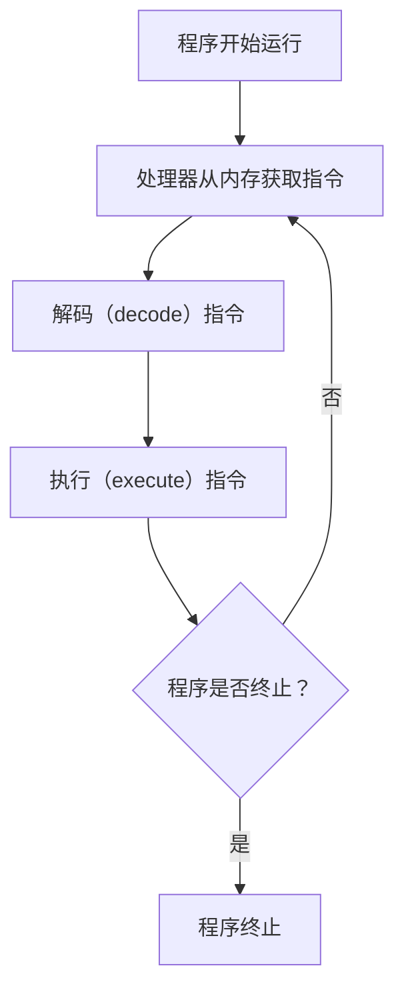

「程序」在运行发生了什么？处理器先从内存中获取一条指令，对其进行解码 decode，然后执行 execute 该指令。然后处理器获取下一条指令，依此类推，直到程序终止。这便是「冯·诺依曼」计算模型的基本概念。



但是如果程序需要等待某些程序（例如 I/O 操作完成）才能继续执行怎么办？处理器会一直等待吗？这显然不是一个好主意，因为处理器资源是宝贵的，应该被充分利用。所以一类软件被设计出来，称为「操作系统」（Operating System, OS），它负责管理计算机的硬件资源，并为其他软件提供服务。

操作系统在管理资源时，使用了一种称为「虚拟化」（virtualization）的技术。虚拟化允许操作系统将物理资源（如 CPU、内存、存储等）抽象成多个虚拟资源，使得多个程序可以同时运行，而不会相互干扰。

除此之外，操作系统还提供了一些接口，供程序调用，以便它们可以请求操作系统执行某些任务，例如文件读写、网络通信等。这些接口通常被称为「系统调用」（system calls）。有时，我们也会说操作系统为应用程序提供了一个标准库（standard library）。

最后，操作系统的共享机制（如共享 CPU、内存、磁盘等），有时也被称为资源管理器（resource manager）。

## 2.1 虚拟化CPU

我们来看看一些实际的例子。假设我们有一个简单的程序 `cpu.c`，它会不断打印传入的字符串参数：

```c title="cpu.c"
#include <stdio.h>
#include <stdlib.h>
#include <sys/time.h>
#include <assert.h>
#include "common.h"

int main(int argc, char *argv[])
{
    if (argc != 2) {
        fprintf(stderr, "usage: cpu <string>\n");
        exit(1);
    }
    char *str = argv[1];
    while (1) {
        Spin(1);
        printf("%s\n", str);
    }
    return 0;
}
```
